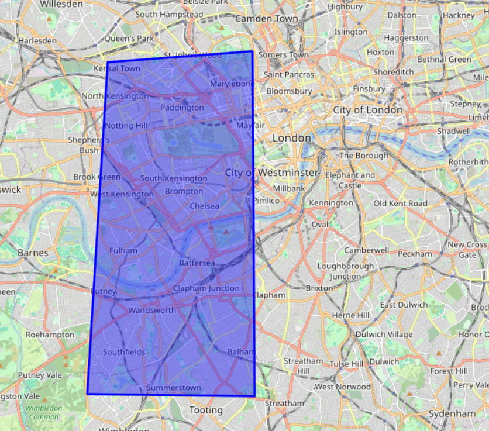

# Предсказание преступления по результатам расследования 

[Ссылка на приложение](https://crimes-prediction-dg2aqcfumpvgunqjtgmv6e.streamlit.app/)

## Описание

Данные для обучения были взяты с сайта data.police.uk, раздел [Street-level crimes](https://data.police.uk/docs/method/crime-street/). API предоставляет возможность загружать данные по отдельным координатам или по областям (полигонам). Выбранный полигон - западный район центрального Лондона ([карта](map/map.html)) 

